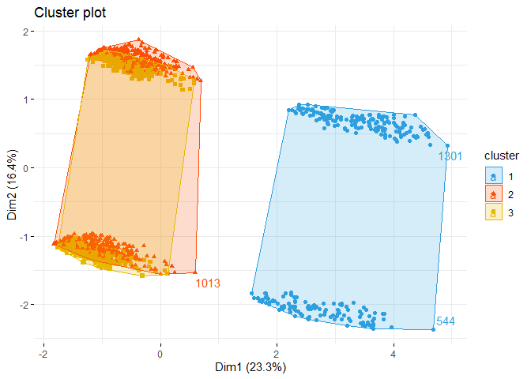

datavis_hw2
================
2022-11-01

\##Загрузка датасета <br>

``` r
ins_cost <- read.csv('insurance_cost.csv')
skimr::skim(ins_cost)
```

|                                                  |          |
|:-------------------------------------------------|:---------|
| Name                                             | ins_cost |
| Number of rows                                   | 1338     |
| Number of columns                                | 7        |
| \_\_\_\_\_\_\_\_\_\_\_\_\_\_\_\_\_\_\_\_\_\_\_   |          |
| Column type frequency:                           |          |
| character                                        | 3        |
| numeric                                          | 4        |
| \_\_\_\_\_\_\_\_\_\_\_\_\_\_\_\_\_\_\_\_\_\_\_\_ |          |
| Group variables                                  | None     |

Data summary

**Variable type: character**

| skim_variable | n_missing | complete_rate | min | max | empty | n_unique | whitespace |
|:--------------|----------:|--------------:|----:|----:|------:|---------:|-----------:|
| sex           |         0 |             1 |   4 |   6 |     0 |        2 |          0 |
| smoker        |         0 |             1 |   2 |   3 |     0 |        2 |          0 |
| region        |         0 |             1 |   9 |   9 |     0 |        4 |          0 |

**Variable type: numeric**

| skim_variable | n_missing | complete_rate |     mean |       sd |      p0 |     p25 |     p50 |      p75 |     p100 | hist  |
|:--------------|----------:|--------------:|---------:|---------:|--------:|--------:|--------:|---------:|---------:|:------|
| age           |         0 |             1 |    39.21 |    14.05 |   18.00 |   27.00 |   39.00 |    51.00 |    64.00 | ▇▅▅▆▆ |
| bmi           |         0 |             1 |    30.66 |     6.10 |   15.96 |   26.30 |   30.40 |    34.69 |    53.13 | ▂▇▇▂▁ |
| children      |         0 |             1 |     1.09 |     1.21 |    0.00 |    0.00 |    1.00 |     2.00 |     5.00 | ▇▂▂▁▁ |
| charges       |         0 |             1 | 13270.42 | 12110.01 | 1121.87 | 4740.29 | 9382.03 | 16639.91 | 63770.43 | ▇▂▁▁▁ |

<br> \#График отношения индекса массы тела и трат на страховку,
раскрашенный по колонке smoker <br>

``` r
plot_ly(
  data = ins_cost,
  x = ~ bmi,
  y = ~ charges,
  color = ~ smoker
)  %>%
  layout(
    title = 'График отношения индекса массы тела и трат на  страховку',
    yaxis = list(title = 'Траты на страховку',
                 zeroline = FALSE),  # Уберём выделения нулевых осей по y
    xaxis = list(title = 'Индекс массы тела',
                 zeroline = FALSE)) # Уберём выделения нулевых осей по y
```

<br> \##То же, через ggplotly <br>

``` r
plot <- ins_cost %>%
  ggplot(aes(x = bmi, y = charges, color = smoker)) +
  geom_point(size = 1.2) +
  labs(x = "ИМТ", y = "Траты на страховку") +
  theme_classic2()

ggplotly(plot)
```

<br> \#Корреляционный анализ insurance cost <br>

``` r
library(corrplot)
```

    ## corrplot 0.92 loaded

``` r
cor_ins_cost <- ins_cost %>%
  select(is.integer|is.numeric)
cor_ins <- cor(cor_ins_cost)
cor_ins
```

    ##                age   children       bmi    charges
    ## age      1.0000000 0.04246900 0.1092719 0.29900819
    ## children 0.0424690 1.00000000 0.0127589 0.06799823
    ## bmi      0.1092719 0.01275890 1.0000000 0.19834097
    ## charges  0.2990082 0.06799823 0.1983410 1.00000000

<br> \##Визуализация анализа минимум двумя новыми способами <br>
\###Первый способ <br>

``` r
corrplot(cor_ins, method = 'color', order = 'alphabet')
```

<!-- -->

<br> \###Второй способ <br>

``` r
corrplot(cor_ins, method = 'square', order = 'FPC', type = 'lower', diag = FALSE)
```

<!-- -->

<br> \#Создание датафрейма, содержащего только нумерические переменные
<br>

``` r
num_ins <- fastDummies::dummy_cols(
  ins_cost,
  select_columns = c("sex","smoker", "region"),
   remove_selected_columns = TRUE
)
```

<br> \#Иерархическая кластеризация на полученном датафрейме <br>

``` r
scaled_num_ins <- scale(num_ins)
#head(scaled_num_ins)
dist_num_ins <- dist(scaled_num_ins, method = "euclidean")
as.matrix(dist_num_ins)[1:6, 1:6]
```

    ##          1        2        3        4        5        6
    ## 1 0.000000 5.825239 6.253322 5.747217 5.759522 4.978144
    ## 2 5.825239 0.000000 1.823634 4.289327 3.582563 3.361726
    ## 3 6.253322 1.823634 0.000000 4.663256 4.148789 3.956548
    ## 4 5.747217 4.289327 4.663256 0.000000 1.807952 4.583438
    ## 5 5.759522 3.582563 4.148789 1.807952 0.000000 4.329507
    ## 6 4.978144 3.361726 3.956548 4.583438 4.329507 0.000000

``` r
res.hc <- hclust(d = dist_num_ins, method = "ward.D2")
library("factoextra")
```

    ## Welcome! Want to learn more? See two factoextra-related books at https://goo.gl/ve3WBa

``` r
fviz_dend(res.hc, cex = 0.5)
```

<!-- -->

<br> \##Еще два графика по иерархической кластеризации из учебника <br>

\###Первый график <br>

``` r
grp <- cutree(res.hc, k = 3)
#head(grp, n = 3)
fviz_cluster(list(data = num_ins, cluster = grp),
             palette = c("#2E9FDF", "#FC4E07", "#E7B800"),
             ellipse.type = "convex", # Concentration ellipse
             repel = TRUE, # Avoid label overplotting (slow)
             show.clust.cent = FALSE, ggtheme = theme_minimal())
```

<!-- -->

<br> \###Второй график <br>

``` r
library(dendextend)
```

    ## 
    ## ---------------------
    ## Welcome to dendextend version 1.16.0
    ## Type citation('dendextend') for how to cite the package.
    ## 
    ## Type browseVignettes(package = 'dendextend') for the package vignette.
    ## The github page is: https://github.com/talgalili/dendextend/
    ## 
    ## Suggestions and bug-reports can be submitted at: https://github.com/talgalili/dendextend/issues
    ## You may ask questions at stackoverflow, use the r and dendextend tags: 
    ##   https://stackoverflow.com/questions/tagged/dendextend
    ## 
    ##  To suppress this message use:  suppressPackageStartupMessages(library(dendextend))
    ## ---------------------

    ## 
    ## Присоединяю пакет: 'dendextend'

    ## Следующий объект скрыт от 'package:ggpubr':
    ## 
    ##     rotate

    ## Следующий объект скрыт от 'package:stats':
    ## 
    ##     cutree

``` r
res.dist <- dist(num_ins, method = "euclidean")


hc1 <- hclust(res.dist, method = "average")
hc2 <- hclust(res.dist, method = "ward.D2")

dend1 <- as.dendrogram (hc1)
dend2 <- as.dendrogram (hc2)

dend_list <- dendlist(dend1, dend2)

tanglegram(dend1, dend2,
           highlight_distinct_edges = FALSE, # Turn-off dashed lines
           common_subtrees_color_lines = FALSE, # Turn-off line colors
           common_subtrees_color_branches = TRUE, # Color common branches
           main = paste("entanglement =", round(entanglement(dend_list), 2))
           )
```

<!-- --> <br>
*Выглядит жутко!* <br> \###Третий график <br>

``` r
fviz_dend(res.hc, k = 4, cex = 0.4, horiz = TRUE, k_colors = "jco",
          rect = TRUE, rect_border = "jco", rect_fill = TRUE)
```

    ## Warning: `guides(<scale> = FALSE)` is deprecated. Please use `guides(<scale> =
    ## "none")` instead.

<!-- -->

<br> \#Одновременный график heatmap и иерархической кластеризации <br>

``` r
library(pheatmap)
pheatmap(scaled_num_ins)
```

<!-- -->

<br> \#Анализ данных того же датафрейма методом PCA. Кратко
интерпретация результатов. <br>

``` r
pca_ins <- prcomp(scaled_num_ins, scale = F) #оно же у нас уже нормированно? 
summary(pca_ins)
```

    ## Importance of components:
    ##                           PC1    PC2    PC3    PC4    PC5     PC6     PC7
    ## Standard deviation     1.6737 1.4023 1.2417 1.1513 1.1498 1.07055 0.98583
    ## Proportion of Variance 0.2334 0.1639 0.1285 0.1105 0.1102 0.09551 0.08099
    ## Cumulative Proportion  0.2334 0.3973 0.5258 0.6363 0.7465 0.84196 0.92295
    ##                            PC8     PC9     PC10      PC11      PC12
    ## Standard deviation     0.87032 0.40877 1.94e-15 7.305e-16 2.932e-16
    ## Proportion of Variance 0.06312 0.01392 0.00e+00 0.000e+00 0.000e+00
    ## Cumulative Proportion  0.98608 1.00000 1.00e+00 1.000e+00 1.000e+00

<br> На первые четыре переменные приходится 64% вариации. Построим
график. <br>

``` r
fviz_eig(pca_ins, 
         addlabels = T, 
         ylim = c(0, 40))
```

<!-- --> <br>
Получилось не очень хорошо, но все же первые три компоненты объясняют
50% дисперсии. 90% дисперсии объясняется только на седьмой главной
компоненте. <br>

``` r
fviz_pca_var(pca_ins, col.var = "contrib")
```

<!-- --> <br>
Брррр. Ну, регион проживания явно вносит малую лепту по сравнению с
полом и курением, хотя по нему наверняка можно здорово делать
кластеризацию. Пол и курение разнонаправленны, это логично. Интересно
сгруппировались charges и курильщики. <br>

``` r
fviz_contrib(pca_ins, choice = "var", axes = 1, top = 24) # 1
```

<!-- -->

``` r
fviz_contrib(pca_ins, choice = "var", axes = 2, top = 24) # 2
```

<!-- -->

``` r
fviz_contrib(pca_ins, choice = "var", axes = 3, top = 24) # 3
```

<!-- --> <br> По
полу и курению хорошо можно кластеризовать данные? <br>

\#График PCA по наблюдениям и переменным. Кластеризация данных на нём по
возрастным группам. <br>

``` r
library(ggbiplot)
```

    ## Загрузка требуемого пакета: plyr

    ## ------------------------------------------------------------------------------

    ## You have loaded plyr after dplyr - this is likely to cause problems.
    ## If you need functions from both plyr and dplyr, please load plyr first, then dplyr:
    ## library(plyr); library(dplyr)

    ## ------------------------------------------------------------------------------

    ## 
    ## Присоединяю пакет: 'plyr'

    ## Следующий объект скрыт от 'package:purrr':
    ## 
    ##     compact

    ## Следующие объекты скрыты от 'package:plotly':
    ## 
    ##     arrange, mutate, rename, summarise

    ## Следующий объект скрыт от 'package:ggpubr':
    ## 
    ##     mutate

    ## Следующие объекты скрыты от 'package:dplyr':
    ## 
    ##     arrange, count, desc, failwith, id, mutate, rename, summarise,
    ##     summarize

    ## Загрузка требуемого пакета: scales

    ## 
    ## Присоединяю пакет: 'scales'

    ## Следующий объект скрыт от 'package:purrr':
    ## 
    ##     discard

    ## Загрузка требуемого пакета: grid

``` r
ggbiplot(pca_ins, 
         scale=0, alpha = 0.1) + 
  theme_minimal()
```

<!-- --> <br>
\##Новая переменная с возрастными группами. <br>

``` r
age_ins <- num_ins %>% 
  mutate(age_group = case_when(
    age < 31 ~ "18-30",
    age >= 31 & age < 46 ~ "31-45",
    age >= 46 & age < 58 ~ "46-57",
    age >= 58 ~ "58+"
    ))
```

<br>

``` r
ggbiplot(pca_ins,
         scale = 0,
         groups = as.factor(age_ins$age_group),
         ellipse = T,
         alpha = 0.1) + 
  theme_minimal()
```

<!-- -->
